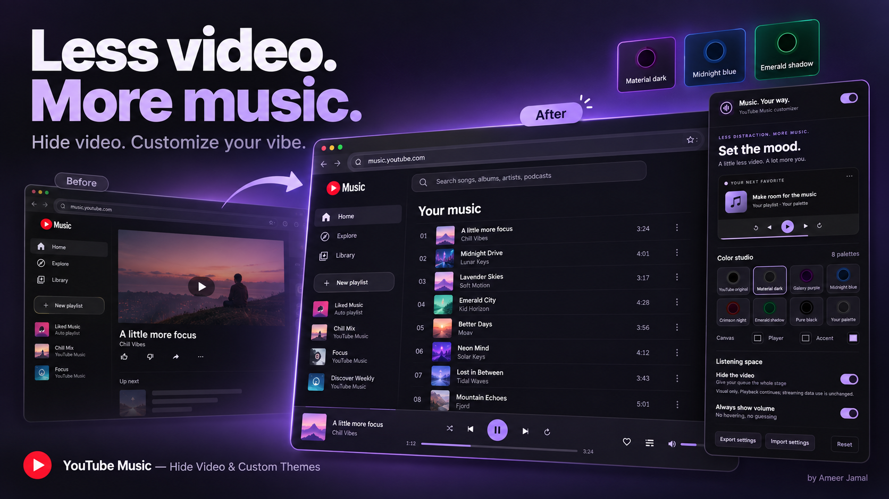
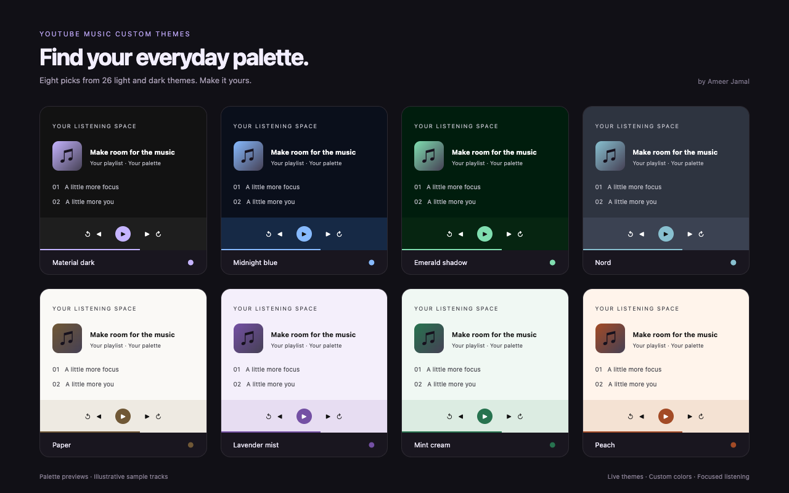
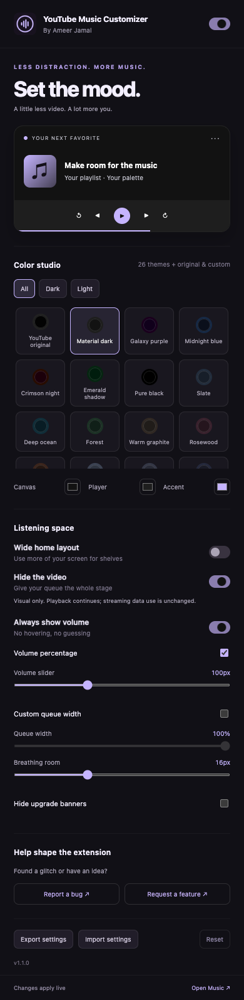

# YouTube Music - Hide Video & Custom Themes



[Download the latest release](https://github.com/Ameer-Jamal/youtube-music-hide-video-custom-themes/releases/latest) · [Report an issue](https://github.com/Ameer-Jamal/youtube-music-hide-video-custom-themes/issues)

A focused YouTube Music experience, built from Ameer Jamal’s YouTube Music Transformer userstyle. Manifest V3, no background worker, no remote code, and only the storage permission.

26 light and dark themes, original and custom palettes, optional wide home layout, custom canvas/player/accent colors, live updates across Music tabs, a full-width queue when video is hidden, always-visible volume, a live, mute-aware volume percentage, adjustable spacing, optional promo hiding, and validated JSON backups.

**Hide video is visual only:** playback continues and streaming data use is unchanged. It does not bypass YouTube Premium or force Song mode.

## Try it

```sh
npm ci
npm run check
npm run build
```

Open chrome://extensions, enable Developer mode, click **Load unpacked**, and select `dist/extension`. Refresh existing YouTube Music tabs once after installing. Open the extension popup and customize. Edge and other Chromium browsers can load the same package.

## Releases and production

CI checks every push and pull request and produces an unpacked **Extension-Package** artifact. The manually dispatched **Release** workflow follows the ChatGPT Material Dark extension’s pipeline: check store state, synchronize version, verify, package, commit version changes, create a GitHub release, upload to the Chrome Web Store, and submit for review. Pending review/upload processing blocks duplicate submissions.

For the first release:

1. Run `npm run build` and upload `dist/youtube-music-hide-video-custom-themes-v1.1.0.zip` to a **new** Chrome Web Store item. Complete the listing using [store copy](docs/STORE-LISTING.md), authentic screenshots, and the [privacy policy](docs/PRIVACY.md).
2. Enable Chrome Web Store API access and authorize the same service-account setup used by your Material Dark extension for this publisher.
3. Create the GitHub environment **Publishing Env**. Add `CWS_EXTENSION_ID` with the **new item’s ID**, `CWS_PUBLISHER_ID`, and `CWS_SERVICE_ACCOUNT_JSON` (raw JSON or base64). Never use your ChatGPT extension’s item ID here.
4. Run **Actions → Release → Run workflow** after the item is ready for API updates. Store approval is controlled by Google.

No publishing credentials are included in this repository. Do not commit `.env` or service-account files. The package uses an explicit allowlist so docs, tests, workflows, and development dependencies stay out of store uploads.

## Verification

The popup credit shows the loaded extension version. After updating an unpacked install, rebuild `dist/extension` with `npm run build`, reload the extension in your browser, then refresh Music. Git pulls alone do not update a previously extracted release ZIP.

`npm run test:home` reproduces the native repeating 50vh backdrop using the observed live DOM structure and stylesheet rule, then verifies pixels across the shelf boundary under light and dark themes. Its private before/after captures are saved under `dist/verification`.

`npm run check` checks syntax, assets, permission scope, version consistency, input validation, palette generation, and reversible toggles. `npm run test:browser` runs popup and content-script integration checks in Chromium using synthetic YouTube Music markup; `npm run test:extension` installs the actual MV3 package in an isolated Chromium profile and checks real storage, manifest injection, cross-tab updates, and reload persistence. Neither substitutes for testing the current logged-in site.

Before store submission, check a real Music account: open the player queue and lyrics, toggle video hiding on/off, play/pause/skip, change volume, resize the window, navigate between pages, try each palette, and turn the extension off. Site markup can change independently of releases.

## Your palette, your player



Palette previews use illustrative sample tracks. The controls below are captured from the actual extension popup.



## Source and license

Original userstyle: **YouTube Music Transformer: Remove Video And Customize Colors**, v1.5.6, by Ameer Jamal. The extension replaces preprocessor-specific styles and brittle oversized queue widths with validated settings and scoped runtime CSS. Original userstyle copies retain CC BY-ND 4.0; extension code is source-available under [LICENSE](LICENSE).
